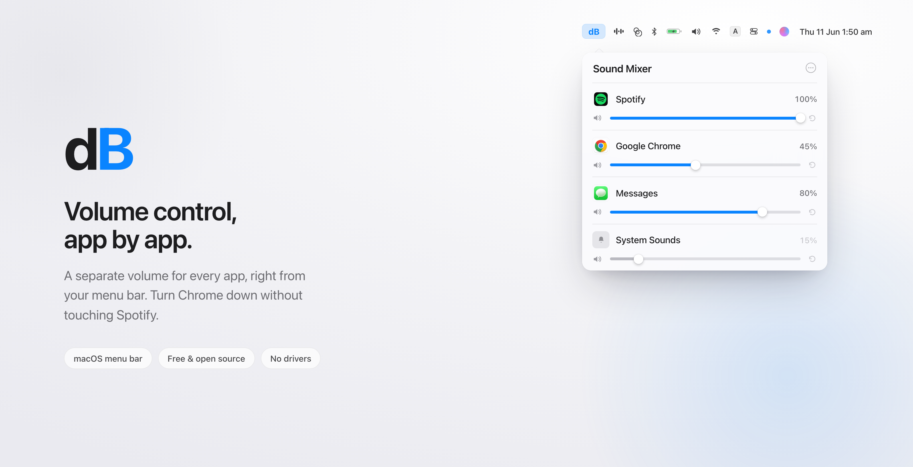

<p align="center">
  
</p>

<h1 align="center">dB</h1>

<p align="center"><strong>Volume control, app by app. Right from your menu bar.</strong></p>

<p align="center">
  Give every app its own volume. Turn Chrome down without touching Spotify.
  Keep a call loud while you mute everything else. It lives in your menu bar,
  it's free, and it's open source.
</p>

<p align="center">
  <a href="https://github.com/routsiddharth/dB/releases/latest">Download</a> ·
  <a href="#install">Install</a> ·
  <a href="#how-it-works">How it works</a> ·
  <a href="#build-from-source">Build</a>
</p>

---

## Contents

- [What it does](#what-it-does)
- [How it works](#how-it-works)
- [Built with](#built-with)
- [Install](#install)
- [Build from source](#build-from-source)
- [Permissions](#permissions)
- [Using dB](#using-db)
- [Limitations](#limitations)
- [For maintainers](#for-maintainers)
- [License](#license)

## What it does

macOS gives you one volume for the whole Mac. dB gives you one for each app.

- **A slider per app.** Spotify at 100, Chrome at 45, system sounds at 15. Set
  each one and forget it.
- **Lives in the menu bar.** Click the **dB** label, set a level, get on with
  your day.
- **Remembers your levels.** Your settings come back the next time an app plays.
- **Stays out of the way.** Manage which apps show up, hide the ones you don't
  touch, and launch dB at login.
- **No drivers, no extensions.** Nothing to install in the kernel. Nothing
  wrapping your audio.
- **Free and open source.** MIT licensed. No paywall, no subscription, no
  account.

Requires macOS 14.4 or later.

## How it works

dB is built on the Core Audio **process tap** API that arrived in macOS 14.4
(`AudioHardwareCreateProcessTap`). When you lower an app's volume, dB does three
things:

1. Taps that app's audio with `muteBehavior = .mutedWhenTapped`, which silences
   its direct output.
2. Creates a private aggregate device around your default output.
3. Plays the tapped audio back through that device at the level you chose.

At 100 percent there's no tap at all. The audio flows through untouched.

## Built with

- **Swift** and **SwiftUI** for the menu bar interface
- **AppKit** for the status item and windows
- **Core Audio** (process taps and aggregate devices) for the audio routing
- **ServiceManagement** for launch at login
- **Swift Package Manager** to build
- **GitHub Actions** to package and publish releases

## Install

### Download

1. Get the latest **`dB-x.y.z.dmg`** from the
   [Releases page](https://github.com/routsiddharth/dB/releases/latest).
2. Open the DMG and drag **dB** into **Applications**.
3. The first time only: right-click **dB** in Applications, choose **Open**,
   then click **Open** again. The app isn't notarized yet, so macOS asks once.
   After that it opens normally.
4. Click the **dB** label in your menu bar.

## Build from source

You'll need the Xcode command line tools.

```sh
git clone https://github.com/routsiddharth/dB.git
cd dB
./build.sh
open dist/dB.app
```

Move `dist/dB.app` to `/Applications` whenever you're ready.

## Permissions

The first time you turn an app down, macOS asks for **System Audio Recording**
permission. That's what the process tap API needs. Grant it in the prompt, or
later under **System Settings → Privacy & Security → Screen & System Audio
Recording → System Audio Recording Only**.

dB routes audio to your speakers with a volume applied. Nothing is recorded.
Nothing is stored. Nothing leaves your Mac.

## Using dB

- Click the **dB** label in the menu bar to open the mixer.
- Apps show up when they're holding an audio stream, and stay listed for the
  session.
- Drag a slider to set that app's volume. Click ↺ to send it back to 100.
- Open **Manage Apps** from the ••• menu to choose which apps appear.
- The ••• menu also has Launch at Login and Quit.

Your custom levels are remembered per app, across launches.

## Limitations

- macOS 14.4 or later only. The process tap API doesn't exist before it.
- Browser audio is grouped under the browser. Every tab shares one system audio
  stream, so per-tab volume isn't possible from outside the browser.
- Apps on unusual audio paths, like some pro audio tools with direct HAL access,
  may not be tappable.

## For maintainers

Push a version tag and GitHub Actions builds the app and publishes a DMG to
Releases:

```sh
git tag v1.0.0
git push origin v1.0.0
```

## License

[MIT](LICENSE)
